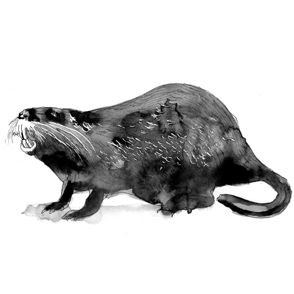

# Wouter Zaalberg Portfolio Website

## Projectoverzicht
Portfolio website voor fotograaf Wouter Zaalberg. De site toont fotografieprojecten over Nederland in "grote en kleine verhalen".

## Sitestructuur

### Homepage (index.html)
- **Hero sectie (1)**: Volledig scherm met achtergrondafbeelding en menu overlay in wit tekstvak
- **About sectie (2)**: Foto "werkterrein.jpg" met kop + tekst, zoom bij scroll
- **Work sectie (3)**: Foto "de-onmisbaren/7.jpg" schermvullend, wit tekstvak met logo's, zoom bij scroll
- **Contact sectie (4)**: Foto "contact.jpg" schermvullend, wit tekstvak met contactformulier, zoom bij scroll
- **Scroll per sectie**: Muiswiel scrollt naar volgende/vorige sectie (desktop only)

### Projectpagina's
**Grote series** (horizontale scroll pagina's):
- wat-kost-een-stad.html
- de-exoten.html
- mijn-tatoeages.html (speciaal format: portret + tattoo + tekstpanel)
- a-better-port.html
- in-blauw-licht.html
- toen-de-mijnen-verdwenen.html

**Kleine series**:
- de-buik-van-de-stad.html
- het-noordzeekanaal-gebied.html
- de-onmisbaren.html
- een-plek-onder-de-zon.html

## Layout Conventies

### Tekstpositie (secties 1-4 homepage)
- Alle tekst uitgelijnd op `left: 60%`
- Maximale breedte: `width: 20%`
- Dit geldt voor: hero-overlay-content, about-text-overlay, work-text-overlay, contact-text-overlay

### Witte Tekstvakken (secties 1, 3, 4)
- Witte semi-transparante achtergrond: `rgba(255, 255, 255, 0.75)`
- Padding: `2rem`
- `box-sizing: border-box`

### Hero Sectie (1) Specifiek
- Menu overlay met twee img elementen voor cross-fade effect
- Default afbeelding: `de-exoten.jpg`
- Zoom animatie: `transform: scale(1.05)` met `transition: 8s ease-out`

### About Sectie (2) Specifiek
- **Kop**: "Nederland als werkterrein" in groen (#2d5a27), Scala Sans SC, uppercase
- **Caption linksonder**: "In de Biesbosch op zoek naar invasieve planten. Uit: De Exoten"
- Caption: wit, italic, `left: 12%`, `bottom: 2rem`

### Work Sectie (3) Specifiek
- **Foto carousel**: Achtergrond wisselt bij klikken op logo's met slide effect
- **Default foto**: de-onmisbaren/7.jpg, schermvullend (100vh, 100vw)
- **Wit tekstvak** met kop "Werk in opdracht" en tekst
- **Logo's**: 20 stuks in grid, grijs standaard, kleur bij hover
- **Caption linksonder**: Dynamisch, past aan bij geselecteerde foto
- Caption: wit, italic, `left: 12%`, `bottom: 2rem`

#### Foto Carousel Systeem
Twee img elementen (`workImage1`, `workImage2`) voor soepele slide transities.

**CSS Classes:**
- `visible`: maakt afbeelding zichtbaar (opacity 1)
- `center`: positioneert afbeelding in zichtbare positie
- `left`: positioneert afbeelding links buiten beeld (na slide-out)
- `horizontal`: voor liggende foto's (100vw, object-fit: cover)

**Liggende foto's (default):**
- 100vw schermvullend met `object-fit: cover`
- Geen extra data-attribuut nodig op logo

**Staande foto's:**
- Gecentreerd op 33% van de pagina (`left: 33%`, `transform: translateX(-50%)`)
- Witte achtergrond voor de rest van het scherm
- Voeg `data-horizontal="false"` toe aan het logo

**Logo data-attributen:**
```html
<!-- Enkele foto (liggend, 100vw) - default -->
<div class="logo-item" data-image="pad/naar/foto.jpg" data-caption="Beschrijving">

<!-- Enkele foto (staand, 33%) -->
<div class="logo-item" data-image="pad/naar/foto.jpg" data-caption="Beschrijving" data-horizontal="false">

<!-- Grid van meerdere foto's (2x2) -->
<div class="logo-item" data-grid="true" data-images="foto1.jpg,foto2.jpg,foto3.jpg,foto4.jpg" data-caption="Beschrijving" data-grid-cols="2">
```

**Grid systeem:**
- `data-grid="true"`: activeert grid modus
- `data-images`: comma-separated lijst van foto paden
- `data-grid-cols="2"`: aantal kolommen (standaard 2)
- Grid foto's gebruiken `object-fit: contain` zodat verticale foto's volledig zichtbaar zijn
- Foto's worden naar het midden gepositioneerd via `object-position`:
  - Linksboven: right bottom
  - Rechtsboven: left bottom
  - Linksonder: right top
  - Rechtsonder: left top
- Gap tussen foto's: 0.5rem

**Huidige logo's met carousel:**
| Logo | Type | Foto's |
|------|------|--------|
| FNV | Enkel | de-onmisbaren/7.jpg |
| Politie | Enkel (staand) | werk-in-opdracht/politie 1.jpg |
| GroenLinks-PvdA | Grid (3) | groenlinkspvda.jpg, pvda 3.jpg, pvda 1.jpg |
| PGGM | Grid (4) | pggm1.jpg, pggm3.jpg, pggm2.jpg, pggm4.jpg |
| Welwonen | Grid (4) | welwonen 1-4.jpg |
| Send | Grid (4) | send.jpg, send2.jpg, send3.jpg, send 4.jpg |
| NZKG | Grid (4) | het-noordzeekanaal-gebied: 6, 5, 8, 10.jpg |
| Cordaan | Grid (4) | cordaan 1.jpg, cordaan 2.jpg, cordaan5.jpg, cordaan4.jpg |
| Benvalor | Grid (4) | benvalor 1.jpg (placeholder x4) |
| Gem. Amsterdam | Grid (3) | gemamsterdam1-3.jpg |
| IG | Grid (4) | ig1.jpg, ig2.jpg, ig 3.jpg, ig4.jpg |
| Meerwaarde | Grid (4) | meerwaarde.jpg, meerwaarde 2-4.jpg |
| Gem. Almere | Grid (4) | wormer 1-4.jpg |
| DGZ | Grid (4) | dgz1-4.jpg |
| WKPA | Grid (4) | wkpa1-4.jpg |

**JavaScript flow:**
1. Klik op logo met `data-image` → `slideToImage()` voor enkele foto
2. Klik op logo met `data-grid` → `showGrid()` voor grid
3. Slide animatie: translateX van rechts naar center (inkomend), center naar links (uitgaand)
4. Klik buiten logo's → terug naar default foto (de-onmisbaren/7.jpg)

### Contact Sectie (4) Specifiek
- **Foto**: contact.jpg, schermvullend (100vh)
- **Wit tekstvak** met contactgegevens en formulier
- **Kop "Contact"**: donker marineblauw (#1a2a3a)
- **Telefoon en email**: lichtblauw (#6a9fc7)
- **Contactformulier**: naam, email, bericht velden + verstuurknop
- **Caption linksonder**: "De Wilhelminaberg, de oude steenberg..." in lichtgrijs (#b0b0b0)

### Zoom Effecten (secties 2-4)
- Foto's starten op `scale(1)`, zoomen naar `scale(1.05)` bij scroll
- Trigger via IntersectionObserver met `.in-view` class
- `transition: transform 8s ease-out`
- Threshold: 30% zichtbaarheid

## Interactie

### Scroll per Sectie (homepage)
- Desktop only (window.innerWidth > 767)
- Muiswiel scrollt naar volgende/vorige sectie
- `scrollIntoView({ behavior: 'smooth', block: 'start' })`
- Scroll debounce: 800ms timeout
- `passive: false` om default scroll te voorkomen

### Hero Image Swap
- Bij hover over menu items met `data-image` attribuut wisselt de achtergrondafbeelding
- Cross-fade effect tussen twee img elementen (heroImage1 en heroImage2)
- Kleur van menu item en "Wouter Zaalberg" titel verandert naar `data-color` waarde
- Titel kleur blijft behouden na mouseleave, menu item reset wel

### Horizontale Scroll (projectpagina's)
- Smooth scroll per foto/sectie met `scrollIntoView({ behavior: 'smooth' })`
- **Queue-based scroll systeem**: meerdere scrolls worden opgeteld
  - 1x scrollen = 1 foto vooruit
  - 2x snel scrollen = 2 foto's vooruit, etc.
- Scroll animatie timeout: 500ms
- Desktop: horizontaal scrollen met muiswiel
- Mobile: verticaal scrollen

### Navigatie (projectpagina's)
- Uniforme navigatie op alle projectpagina's
- Terug link: `← Terug` (bovenste regel, kleiner)
- Paginanaam: Onder de terug link, groter lettertype (Scala Sans SC, uppercase)
```html
<nav class="horizontal-nav">
    <div>
        <a href="index.html" class="back-link">← Terug</a>
        <span class="nav-title">Paginanaam</span>
    </div>
</nav>
```

## Stijl & Design

### Fonts
- **Scala Sans**: Hoofdtekst
- **Scala Sans SC**: Koppen (small caps, uppercase)
- **Minion Pro**: (beschikbaar maar niet primair gebruikt)

### Kleuren
```css
--color-gold: #cd9854;      /* Accent kleur */
--color-black: #000000;
--color-white: #ffffff;
--color-gray-light: #f5f5f5;
--color-dark-blue: #1a3a52;
```

### Data-kleuren per project (hero hover)
- Wat kost een stad: `#5c7a3d`
- De Exoten: `#2d5a27`
- Mijn Tatoeages: `#8b4513`
- A Better Port: `#1e4a6d`
- In Blauw Licht: `#1a3f5c`
- Toen de Mijnen verdwenen: `#8b2500`

## Logo's (sectie 3)

### Structuur
- **Locatie grijs**: `logo's/grijs/` - standaard weergave
- **Locatie kleur**: `logo's/kleur/` - hover weergave
- **Hover effect**: grijs fades uit, kleur fades in (0.3s transitie)

### Beschikbare logo's
aeb, anp, benvalor, cordaan, fnv, gemamsterdam, glpvda, ig, meerwaarde, nzkg, pggm, pnh, politie, send, welwonen, wkpa

### HTML structuur per logo
```html
<div class="logo-item">
    
    
</div>
```

### CSS
- Container: `display: flex; flex-wrap: wrap; gap: 0.25rem`
- Logo hoogte: `max-height: 75px`
- Grijs: `opacity: 1` standaard, `opacity: 0` bij hover
- Kleur: `position: absolute`, `opacity: 0` standaard, `opacity: 1` bij hover

## Responsive Breakpoints (homepage)

### Laptops (1100px - 1400px)
- Kleinere lettergroottes
- Tekstvak begint hoger (top: 10-12%)
- `max-height` met `overflow-y: auto` voor scrollbare tekstvakken
- Kleinere logo's en formuliervelden

### Kleine laptops (768px - 1100px)
- Nog kleinere tekst
- Breder tekstvak (25% i.p.v. 20%)
- Compactere layout

### Mobiel (< 767px)
- Verticale layout
- Tekstvakken relative positioned
- Volledige breedte

## Mijn Tatoeages Pagina (speciaal format)

### Structuur
- **Intro sectie**: Grote foto (1a.jpg) + grijs panel (#2a2a2a) met logo en tekst
- **Story secties**: Portret foto + Tattoo foto + Tekstpanel met blur achtergrond
- Elke sectie neemt `min-width: 100vw` zodat je per scroll één verhaal ziet

### Afmetingen (desktop)
- Foto's: `height: 58vh`
- Tekstpanel: `width: 420px`, `height: 100vh`, `padding-top: 21vh` (uitgelijnd met bovenkant foto's)
- Intro panel: `height: 70vh`, `width: 420px`
- Gap tussen foto's: `0.5rem`

### Tekstpanel uitlijning
- Foto's zijn 58vh en verticaal gecentreerd → bovenkant op 21vh
- `.story-text-panel` heeft `padding-top: 21vh` en `justify-content: flex-start`
- `.story-text-content` heeft `padding: 0 3rem 3rem 3rem` (geen top padding)

### Elementen
- **Persoonsnaam**: Onder linker portretfoto, links uitgelijnd, `font-weight: 600`, gekleurde tekst
- **Scroll pijl**: Rechtsonder in tekstpanel, geanimeerd (pulseert naar rechts)
- **Logo**: `mijn-tattoos/logo.png` in intro panel, `max-width: 250px`

### Blur achtergronden
- Locatie: `mijn-tattoos/Blurs/`
- Gebruikt als `.story-text-bg` met `opacity: 0.7`

### Tattoo Teken Effect
Canvas animatie die mijn-symbolen tekent in de marges van de pagina.

**Symbolen** (5 stuks):
- **Mijnlamp**: Davy safety lamp met haak, gaaskorf en brandstoftank
- **Hamer en beitel**: Gekruist mijnwerkersteken ⚒️
- **Steenkool**: Hoekig brok met facetten
- **Schachtbok**: A-frame met schijfwielen bovenaan
- **Penning**: Ronde mijnwerkerspenning met nummer "45"

**Technische details**:
- Canvas overlay: `position: fixed`, `pointer-events: none`, `z-index: 50`
- Lijnstijl: `rgba(255, 255, 255, 0.12)`, `lineWidth: 0.8`
- Eerste symbool start linksonder (120px, 150px van onder)
- Volgende symbolen: random in marges (links, rechts, boven, onder)
- Max 15 symbolen bewaard, oude worden verwijderd
- Sparkle effect bij tekenpunt met kruisvormige uitstraling

**Hint tekst**:
- Positie: linksonder (`bottom: 2rem`, `left: 2rem`)
- Tekst: "Terwijl jij de foto's bekijkt, wordt deze pagina ondergetatoeëerd"
- Fade-in na 2 seconden, fade-out na eerste symbool klaar
- Stijl: 0.7rem, italic, 35% wit opacity

```javascript
// Symbool structuur (genormaliseerde 0-1 coördinaten)
const symbols = {
    lamp: [[x, y], [x, y], null, ...],  // null = pen omhoog
    hammerPick: [...],
    coal: [...],
    schacht: [...],
    penning: [...]
};
```

### Responsive breakpoints
- **< 1200px**: Foto's 50vh, tekstpanel 300px
- **< 1024px**: Foto's 45vh, tekstpanel 280px
- **< 767px**: Verticaal scrollen, alles onder elkaar, volle breedte

## Toen de Mijnen Verdwenen Pagina

### Eigen stylesheet
- `css/toen-de-mijnen.css` - aparte CSS voor deze pagina
- Adobe Typekit: Chloe font voor titels (`https://use.typekit.net/qwc4lnx.css`)
- Leaflet.js voor interactieve kaart

### Kleuren (drie delen)
```css
--tdmv-bg: #1a1816;
--tdmv-bg-dark: #0f0e0d;
--tdmv-text: #f5f2ed;
--tdmv-text-muted: #8a857d;

/* Part 1: Golden Era (1965-1974) - Warm amber */
--tdmv-part1-accent: #c55a11;
--tdmv-part1-bg: #1f1a15;

/* Part 2: Abandonment (1974-2000) - Cool grays */
--tdmv-part2-accent: #6b7a8a;
--tdmv-part2-bg: #161a1d;

/* Part 3: Renewal (2000-now) - Green */
--tdmv-part3-accent: #8b9a6b;
--tdmv-part3-bg: #181a16;
```

### Structuur
- **Hero sectie**: Titel met instort-animatie + intro tekst, gecentreerd
- **Descent effect**: Scroll omlaag om "af te dalen in de mijn", onthult foto 1
- **Chapter panels**: Schermvullende overgang tussen de drie delen
- **Foto blokken**: Met caption box rechts naast de foto
- **Insert panels**: Paginabrede secties met fade-out bij scrollen
- **Highlighted photos**: Foto met gekleurd tekstpaneel ernaast (foto 3, 12, 23a, 28)
- **Progress indicator**: Percentage linksonder dat mee-animeert met scroll
- **Spacing**: `gap: 12rem` tussen elementen

### Titel instort-animatie
- Na 5 seconden vallen de letters één voor één naar beneden
- Staggered delays per letter met random rotaties
- Na ~10 seconden fadet de titel weer in op originele plek

### Progress indicator
- Positie: linksonder (`bottom: 2rem`, `left: 2rem`)
- Toont percentage (0-100%) van serie bekeken
- Animeert soepel bij scrollen (beide richtingen)
- Subtiel wit (50% opacity)

### Descent effect (intro)
```html
<div class="tdmv-intro-section" id="introSection">
    <div class="tdmv-descent">
        <div class="tdmv-hero-panel"><!-- Titel + tekst --></div>
        <div class="tdmv-intro-photo"><!-- Foto 1 --></div>
    </div>
</div>
```
- Scroll omlaag: `introSection.classList.add('descended')`
- Verticale slide transitie (1.2s) simuleert afdaling in mijn

### Mijn achtergrond (deel 1)
- `mijngang.jpg` als subtiele vaste achtergrond (12% opacity)
- Alleen zichtbaar tijdens deel 1 foto's
- Gecontroleerd via IntersectionObserver met `.visible` class

### Interactieve kaart (Leaflet.js) - Insert "De Mijnstreek"
- Insert panel na foto 5 met titel "De mijnstreek"
- CSS Grid layout: titel linksboven, kaart links, statistieken rechts (2 kolommen)
- Leaflet kaart met CartoDB grayscale tiles, donkerblauw popup (#1a3a52)
- Custom oranje markers met foto's in popup (max 200px)
- Klikbare mijnnamen in statistieken → pannen naar marker
- 12 mijnen met productie (mln ton) en arbeiders data
- Twee balken per mijn: oranje (productie), grijs (arbeiders)

### Insert panels
| Insert | Deel | Inhoud | Fade-out trigger |
|--------|------|--------|------------------|
| De Mijnstreek | 1 | Kaart + statistieken | Foto Zakia |
| Het grote slopen | 2 | Foto's + infographics | Foto Zakia |
| Uit het dal | 3 | Foto + tekst naast elkaar | Foto Bart |
| Als expositie en in de media | 3 | 6 foto's grid + tekst | - |

### Foto groottes
- Standaard: 70vh
- `size-large`: 90vh

### Highlighted photos (foto met tekstpaneel)
Foto's 3, 12, 23a en 28 hebben een gekleurd tekstpaneel:
```html
<div class="tdmv-photo-highlight part-1">
    
    <div class="tdmv-highlight-panel">
        <div class="tdmv-highlight-header">Naam</div>
        <div class="tdmv-highlight-text">Quote of tekst</div>
        <div class="tdmv-highlight-description">Optionele beschrijving</div>
    </div>
</div>
```
- Part-1: oranje panel (rgba(197, 90, 17, 0.7))
- Part-2: grijs panel (rgba(107, 122, 138, 0.7))
- Part-3: groen panel (rgba(139, 154, 107, 0.7))

### Zoom effect (foto 12 en 40)
- Wrapper met `overflow: hidden` om zoom binnen kader te houden
- Class `zoom-delayed` op img, `zoom-active` bij in-view
- 2 seconden delay, 12 seconden zoom naar scale(1.08)

### Chapter panels
```html
<div class="tdmv-chapter chapter-1" data-section="chapter">
    <div class="tdmv-chapter-content">
        <div class="tdmv-chapter-number">Deel 1</div>
        <h2 class="tdmv-chapter-title">De wereld die verdween</h2>
        <div class="tdmv-chapter-period">1965 — 1974</div>
        <p class="tdmv-chapter-intro">Introductietekst...</p>
    </div>
    <span class="tdmv-chapter-arrow">→</span>
</div>
```

## A Better Port Pagina

### Eigen stylesheet
- `css/a-better-port.css` - aparte CSS voor deze pagina

### Kleuren
```css
--abp-bg: #e8e4df;                    /* Lichte achtergrond */
--abp-bg-dark: rgba(30, 40, 50, 0.85); /* Donker overlay voor captions */
--abp-yellow: rgba(225, 200, 90, 0.85); /* Geel uit veiligheidshesje */
--abp-yellow-solid: #e1c85a;          /* Solide geel */
--abp-accent: #2c3e50;                /* Donker accent */
--abp-text: #1a1a1a;
--abp-text-light: #ffffff;
--abp-text-muted: #666666;
```

### Structuur
- **Dark overlay**: Dynamische donkere overlay die verandert op basis van scroll positie
- **Rotating background**: 3 achtergrondafbeeldingen (achtergrond 1, 2, 3) die herhalen
- **Intro sectie**: 3 states - Tekstpaneel → Foto 1 → Foto 2 (alle met fade transities)
- **Foto blokken**: Met info button en fade-in caption, padding 10rem tussen foto's
- **Foto paren**: 11+12, 13+14, 21+22, 32+33, 38+39 (gap 0.5rem binnen paar)
- **Quote panels**: Gele achtergrond, volle paginabreedte (100vw), met reveal effect
- **Tekst panel na foto 6**: Direct zichtbaar geel tekstpaneel

### Intro sectie (3 states: tekst → foto 1 → foto 2)
De intro sectie neemt de volledige viewport in beslag (100vw x 100vh) met 3 states:
- **State 0**: Tekstpaneel met wit semi-transparant kader, gele titel "A BETTER PORT" links ernaast
- **State 1**: Foto 1 gecentreerd (80vh) met gele achtergrond (bij eerste scroll vooruit)
- **State 2**: Foto 2 schermvullend (100vh) (bij tweede scroll vooruit)
- Alle transities: 0.8s ease fade effect
- Bij terugscrollen: omgekeerde volgorde
- Scheepsanimatie zichtbaar bij state 0 en 1, verdwijnt bij state 2

```html
<div class="abp-intro-section" id="introSection">
    <h1 class="abp-hero-title" id="introTitle">...</h1>
    <div class="abp-intro-photo">...</div>         <!-- Foto 1 (hidden by default) -->
    <div class="abp-intro-panel">...</div>         <!-- Tekstpaneel (visible by default) -->
    <div class="abp-intro-photo2">...</div>        <!-- Foto 2 -->
</div>
```

JavaScript states:
- `introState = 0`: Tekstpaneel zichtbaar (default)
- `introState = 1`: `introSection.classList.add('show-photo1')`
- `introState = 2`: `introSection.classList.add('show-photo2')`

### Intro tekst
- **Breedte**: 100% van foto 1 breedte (via JS)
- **Uitlijning**: Verticaal gecentreerd, onderkant op 10vh van viewport onderkant
- **Achtergrond**: Wit semi-transparant `rgba(255, 255, 255, 0.35)`
- **Padding**: 3rem aan alle kanten
- **Lettergrootte**: 1.1rem, line-height 2.1
- **Tekstkleur**: Wit (#ffffff)
- **Credit**: Geel (--abp-yellow-solid)

De serie gaat over de haven van Amsterdam als spiegel van de energietransitie:
- Amsterdam als grootste benzinehaven ter wereld
- Steenkool die plaatsmaakt voor andere bulkgoederen
- Port of Amsterdam's transitie naar duurzaam, circulair, waterstof
- Het spanningsveld tussen fossiele afhankelijkheid en verduurzaming
- Credit: "Wouter Zaalberg, Amsterdam, maart 2024"

### Hero titel
```css
.abp-intro-section > .abp-hero-title {
    position: absolute;
    bottom: 11vh;
    text-align: right;
    color: transparent;
    -webkit-text-stroke: 2px var(--abp-yellow-solid);
    text-stroke: 2px var(--abp-yellow-solid);
    /* right wordt via JS gezet */
}
```
- Transparant lettertype met gele outline (--abp-yellow-solid / #e1c85a)
- **Positie**: LINKS van de foto/tekstpaneel, rechts uitgelijnd
- Font: Scala Sans SC, uppercase

### Dark overlay
Dynamische overlay die de achtergrond donkerder/lichter maakt:
- Foto 1-2: donker (opacity 0.8)
- Foto 3-19: geleidelijk lichter (0.8 → 0)
- Foto 19-41: licht (opacity 0)
- Foto 42-44: geleidelijk donkerder (0 → 0.8)
- Foto 44+: donker (opacity 0.8)

### Achtergrond systeem (dual background)
Bij foto 1 (intro) wordt een Leaflet kaart met scheepvaartanimatie getoond. Na scrollen naar foto 2+ verschijnt de originele rotating background.

**Leaflet kaart achtergrond (alleen bij intro):**
- CartoDB dark tiles met grayscale filter
- Gecentreerd op Port of Amsterdam: `[52.413, 4.82]`, zoom 13
- Non-interactief (geen zoom/pan)
- CSS: `filter: grayscale(100%) brightness(0.25) contrast(1.2)`

**Scheepvaart animatie:**
- Canvas overlay met bewegende bootjes
- Routes gebaseerd op echte havencoördinaten:
  - Route 0: Noordzeekanaal (hoofdvaarweg, 8 schepen)
  - Route 1-4: Westelijke havens (groen, blauw, geel, roze)
  - Route 5-7: Centrale havens (turquoise, oranje, nieuwe lijn)
  - Route 8: Limegroen haven
  - Route 9-11: IJ waterway en oostelijke havens
- Bootjes: geel (`rgba(225, 200, 90, 0.4)`), zeer langzaam varend
- Navigatie: schepen varen van/naar zee via Noordzeekanaal
- Collision detection: schepen houden afstand op zelfde route
- Stopt automatisch bij foto 2 (niet meer zichtbaar)

**Originele rotating background (na intro):**
- Locatie: `a-better-port/achtergrond 1.jpg`, `achtergrond 2.jpg`, `achtergrond 3.jpg`
- Opaciteit: 0.15
- Breedte: 300% (voor scroll effect)
- Verschijnt met fade transitie bij scroll naar foto 2+

### Info button (caption toggle)
```html
<div class="abp-photo-block">
    
    <button class="abp-info-btn">i</button>
    <div class="abp-caption">
        <div class="abp-caption-header">Onderschrift</div>
        <div class="abp-caption-text">Tekst</div>
    </div>
</div>
```
- Button: wit, rond, italic "i", rechts onderaan foto
- Caption: fade-in effect bij klik op info button
- Alleen één caption tegelijk open
- **Hero image**: Ook de hero foto (foto 1) heeft een info button en caption
  - JavaScript ondersteunt zowel `.abp-photo-block` als `.abp-hero-image` voor info toggle
  - CSS class `.abp-hero-image.info-active` voor caption visibility

### Quote panels met reveal effect
```html
<div class="abp-quote-panel">
    <div class="abp-quote-inner">
        <p class="abp-quote-text">"Quote tekst"</p>
        <p class="abp-quote-source">- Bron</p>
    </div>
</div>
```
- Gele achtergrond (--abp-yellow)
- Volle paginabreedte (100vw) en hoogte (100vh)
- Reveal effect: inhoud schuift omhoog en fades in via Intersection Observer
- Decoratieve lijnen boven en onder

### Foto groottes en spacing
- Standaard: 70vh
- `size-full`: 100vh (volledige paginahoogte)
- **Spacing**: 10rem padding tussen alle foto's (inclusief size-full)
- **Foto paren**: 10rem buitenste padding, 0.5rem interne gap

### Foto paren
```html
<div class="abp-photo-pair">
    <div class="abp-photo-block">...</div>
    <div class="abp-photo-block">...</div>
</div>
```
Foto paren: 3+4, 11+12, 13+14, 15+16, 21+22, 32+33, 38+39

### Foto grid (2x2)
```html
<div class="abp-photo-grid">
    <div class="abp-grid-item">...</div>
    <div class="abp-grid-item">...</div>
    <div class="abp-grid-item">...</div>
    <div class="abp-grid-item">...</div>
</div>
```
- Foto grid 25-28: 2x2 layout met 70vh hoogte
- Elke grid item heeft info button en caption

### Infographic panels
Twee gele infographic panels met data visualisaties:

**Panel 1 - Na foto 6:**
- Achtergrond: olietanker.jpg met gele overlay
- Titel: "Een haven ter waarde van 4,4 miljard euro"
- Tekst over Amsterdam als grootste benzinehaven
- Horizontale staafgrafiek met havenstatistieken (2024)

**Panel 2 - Na foto 24:**
- Titel: "Een haven in verandering"
- Tekst over verduurzaming en klimaatneutraliteit 2050
- Donut charts: opslagcapaciteit alternatieve brandstoffen (5,4% → 10,1%)
- Progress bars: zonnepanelen (260.000 m² → 350.000 m² doel)

### Text-photo combo (foto 17)
```html
<div class="abp-text-photo-combo">
    <div class="abp-combo-text">
        <h3 class="abp-combo-title">9 maanden van huis</h3>
        <p>Tekst...</p>
    </div>
    <div class="abp-combo-photo">...</div>
</div>
```
- 50% geel tekstvak links, 50% foto rechts
- Foto 17 met zoom effect (8s, scale 1.08)
- Titel en tekst met fade-in animatie

## In Blauw Licht Pagina

### Eigen stylesheet
- `css/in-blauw-licht.css` - aparte CSS voor deze pagina

### Foto's
- **Locatie**: `in-blauw-licht/`
- **Bestandsnamen**: `foto 1.jpg` t/m `foto 32.jpg`
- 32 foto's totaal, allemaal met bijschriften

### Kleuren en achtergrond
```css
--ibl-bg-dark: #0a0a0c;              /* Intro panel achtergrond */
--ibl-bg-light: #f0f0f0;             /* Lichtgrijs */
```
- **Achtergrond gradient**: Van donker (#0a0a0c) naar lichtgrijs (#f0f0f0)
  - 0-5%: Donker (zelfde als intro panel)
  - 5-50%: Geleidelijke overgang
  - 50-100%: Lichtgrijs
- Gradient op `.horizontal-scroll-content` zodat het mee-scrollt

### Z-index lagen
1. Scroll container (z-index: 2)
2. Politiestrepen animatie (z-index: 50)
3. Navigatie (z-index: 100)

### Hero sectie
- **Foto**: 45vw breed, 100vh hoog, start op `left: 10vw`
- **Donkere strip links**: 10vw breed, #0a0a0c (::before pseudo-element)
- **Titel**: Rechtsonder in de foto, rechts uitgelijnd, `bottom: 15vh`
- **Intro panel**: 55vw breed, bijna zwart (#0a0a0c)
- **Intro tekst**: Uitgelijnd met titel (`align-items: flex-end`, `padding-bottom: 15vh`)
- **Zoom animatie**: Start na 2s, 12s duur, scale naar 1.05

### Navigatie
- Transparante achtergrond (geen gradient)
- Donkere tekst (#1a1a1a)

### Scroll systeem
- `position: fixed` scroll container
- Foto's worden gecentreerd in viewport bij scrollen
- Formule: `scrollLeft = elementLeft - (viewportWidth - elementWidth) / 2`

### Foto groottes
- Standaard: 60vh
- `size-full`: 90vh (gecentreerd)
- Padding tussen foto's: 12rem (responsive: 8rem → 6rem → 2rem)

### Info button (caption toggle)
```html
<button class="ibl-info-btn">i</button>
<div class="ibl-caption">
    <div class="ibl-caption-header">Titel – Locatie</div>
    <div class="ibl-caption-text">Beschrijving</div>
</div>
```
- Button: donker (#000, 70% opacity), rond, italic "i", z-index: 20
- Caption: donkere achtergrond (rgba(26, 36, 47, 0.9)), fade-in effect
- Klik op "i" togglet caption aan/uit
- Klik buiten foto sluit alle captions

### Toggle alle onderschriften knop
```html
<button class="ibl-toggle-all-btn" id="toggleAllCaptions">
    <span class="toggle-text">Toon alle onderschriften</span>
</button>
```
- Positie: links onderin (`bottom: 2rem`, `left: 2rem`)
- **Alleen zichtbaar vanaf foto 2** (na hero sectie)
- Toggle tekst: "Toon alle onderschriften" ↔ "Verberg alle onderschriften"
- Klik op individuele "i" terwijl alle aan staan: alleen die caption togglet

### Politiestrepen animatie
Geanimeerde diagonale strepen die de striping van politieauto's nabootsen.

**HTML elementen:**
```html
<div class="ibl-stripes-red" id="stripesRed"></div>
<div class="ibl-stripes-blue" id="stripesBlue"></div>
```

**Strepen:**
- **4 rode strepen**: Bovenste helft (50vh), diagonaal (-65deg)
- **5 blauwe strepen**: Onderste helft (50vh), diagonaal (-65deg)
- Opacity: 15%, gecentreerd op scherm

**Animatie:**
- Trigger: Bij foto 10 (index 9)
- **Rood**: Komt van boven het scherm, beweegt naar beneden en verdwijnt onder
- **Blauw**: Komt van onder het scherm, beweegt naar boven en verdwijnt boven
- **Horizontaal**: Beweegt van links-van-midden naar rechts-van-midden tijdens scroll
- Geen fade, alleen beweging

**JavaScript animatie logica:**
```javascript
// Verticaal: rood van -50vh naar +60vh, blauw van +50vh naar -60vh
const redVertical = -50 + (animationProgress * 110);
const blueVertical = 50 - (animationProgress * 110);

// Horizontaal: -15vw naar +15vw
const horizontalOffset = -15 + (animationProgress * 30);
```

### End panel
- Hoogte: 100vh
- Achtergrond: #1a2530 (donkerblauw)

### Responsive
- **< 1024px**: Intro panel gecentreerd, foto's 50vh/80vh
- **< 767px**: Verticaal scrollen, volle breedte

## Het Noordzeekanaal Gebied Pagina

### Structuur
- **Achtergrond**: Licht (#f5f5f5 via horizontal-scroll-page)
- **Navigatie**: Uitgelijnd met eerste foto (padding-left: 4rem)
- **Volgorde**: Foto 2 → Intro panel → Foto 1 → Foto paar 3+4 → Foto 5 → etc.
- **Foto's**: 17 foto's op 70vh (standaard)
- **Grote foto's**: Foto 5 en 15 op 90vh via `style="height: 90vh;"` op `.photo-item`
- **Foto paren**: 3+4, 6+7, 10+11 (scrollen als één geheel)
- **Gap**: 12rem tussen elementen
- **End panel**: Donkergrijs (#1a1a1a) met links

### Bijschriften (hover captions)
```css
.photo-caption {
    position: absolute;
    bottom: 2rem;
    left: 50%;
    transform: translateX(-50%);
    opacity: 0;
    transition: opacity 0.3s ease;
    background: rgba(0, 0, 0, 0.7);
    padding: 1rem 1.5rem;
    width: 80%;
    max-width: 600px;
    text-align: left;
}
.photo-item:hover .photo-caption {
    opacity: 1;
}
```

### Bijschrift format
```html
<div class="photo-caption">
    <span class="caption-main">Naam en functie</span>
    <span class="caption-detail">Uitgebreide beschrijving</span>
    <span class="caption-location">Locatie: Plaatsnaam</span>
</div>
```
- **caption-main**: wit, 0.95rem
- **caption-detail**: 85% wit, 0.8rem, line-height 1.5
- **caption-location**: 70% wit, 0.75rem, italic

### Foto paren
```html
<div class="photo-pair">
    <div class="photo-item">...</div>
    <div class="photo-item">...</div>
</div>
```
- Gap: 0.5rem tussen foto's in paar
- `scroll-snap-align: center` op photo-pair
- JavaScript selector selecteert `.photo-pair` als geheel (niet individuele foto's)
- Scrollen gaat per paar, beide foto's zichtbaar en gecentreerd

## De Exoten Pagina

### Kleuren
```css
body.horizontal-scroll-page: #ffffff;  /* Witte achtergrond */
.gray-section: #f0f0f0;                /* Lichtgrijs vanaf foto 8 */
.intro-panel: #e8e8e8;                 /* Tekstvak achtergrond */
color: #1a1a1a;                        /* Donkere tekst */
```

### Structuur
1. **Intro sectie** (gecentreerd op scherm)
   - Foto 1 (70vh) + Intro wrapper (titel + beverrat + tekstvak)
   - `min-width: 100vw`, `justify-content: center`
2. **Cluster 1** - foto's 2-7 dicht bij elkaar (gap: 0.4rem)
3. **Hoofdstuk titel** - "hoofdstuk 1 / de slag / om de / grenzen" (rechts uitgelijnd, italic bold)
4. **Grijze sectie** (background: #f0f0f0) met:
   - Foto 8 met bijschrift - wasbeer sectie
   - Beverrat cluster - complexe grid met foto's 9-15
   - Wolhandkrab cluster - foto's 16 + 17
5. **End panel** - donkergroen (#1a3d1a)

### Intro Wrapper
```html
<div class="intro-wrapper">
    <h1 class="intro-title">De Exo<span>ten</span></h1>
    <div class="intro-image"></div>
    <div class="intro-panel"><p>Tekst...</p></div>
</div>
```
- Titel: Scala Sans, 3.5rem, "ten" cursief
- Breedte dynamisch gelijk aan foto 1 (via JavaScript)
- Totale hoogte: 70vh

### Verticale Labels
```css
.vertical-label {
    position: absolute;
    bottom: 100%;
    left: 0;
    writing-mode: vertical-rl;
    transform: rotate(180deg);
    font-family: 'Scala Sans', sans-serif;
    font-weight: 700;
    font-size: 1.6rem;
    letter-spacing: 0.15em;
}
.vertical-label .accent {
    font-family: 'Minion Pro', 'Times New Roman', serif;
    font-style: italic;
}
```
- Altijd één letter cursief in ander font (Minion Pro)
- Voorbeeld: `wasb<span class="accent">e</span>er`
- Uitgelijnd met linkerkant van foto

### Bijschriften (Caption Boxes)
```html
<div class="photo-with-caption caption-right">
    <div class="photo-item"></div>
    <div class="photo-caption-box" style="margin-top: 23vh;">
        <h4 class="caption-title">Titel</h4>
        <p class="caption-text">Tekst...</p>
    </div>
</div>
```
- Transparante achtergrond met blauwe rand (`#a8c8e8`)
- Posities: `caption-right`, `caption-left`, `caption-top`, `caption-bottom`
- Verticale positie via `margin-top` (bijv. 23vh = 1/3 van 70vh foto)
- Gap tussen foto en bijschrift: 1.5rem

### Beverrat Cluster (complexe grid)
```
beverrat-cluster (padding-left: 3rem, padding-top: 2rem)
├── vertical-label "beverrat" (absolute, top-left)
├── beverrat-col1 (diana airbug, 18vh, blauwe bg #a8c8e8, align-self: center)
├── beverrat-col23
│   ├── col23-top (foto 9 + 10, elk 18vh)
│   └── col23-bottom (foto 11, 42vh)
├── beverrat-col45
│   ├── col45-top (foto 12, 48vh)
│   └── col45-bottom (foto 13 + 14, elk 21vh)
└── beverrat-col6 (caption + foto 15, 21vh, align-self: flex-start)
```

### Foto's
- **Locatie**: `de-exoten/`
- **Genummerde foto's**: 1.jpg - 17.jpg
- **Cluster foto's**: cluster 1 foto 2-7.jpg
- **Speciale foto's**: beverrat.jpg, diana airbug a.jpg, snoek.jpg, klem.jpg, schep.jpg, verdelger.jpg, zender.jpg, wouter soorten.jpg, info 1-3.jpg

### JavaScript Selectors
```javascript
const allItems = document.querySelectorAll(
    '.intro-section, .photo-cluster, .photo-with-caption, .beverrat-cluster, .gray-section .photo-item, .end-panel'
);
```

### TODO
- [ ] Meer clusters/secties toevoegen
- [ ] Bijschriften invullen met echte tekst
- [ ] Responsive aanpassingen

## De Onmisbaren Pagina

### Structuur
- **Achtergrond**: Donkergrijs (#2a2a2a)
- **Navigatie**: Wit, uitgelijnd met eerste foto (padding-left: 4rem)
- **Intro sectie**: 100vw x 100vh met foto 1 links en intro panel rechts
- **Foto's**: 9 foto's (1.jpg - 9.jpg) op 70vh
- **Gap**: 12rem tussen elementen
- **End panel**: Donkergrijs (#1a1a1a), 100vh

### Intro sectie layout
- **Foto 1**: Absoluut gepositioneerd, 100vh hoog, links van center (`transform: translateX(-110%)`)
- **Intro panel**: Absoluut gepositioneerd, verticaal gecentreerd, rechts van center (`transform: translate(-10%, -50%)`)
- Caption onder foto 1 met naam en functie

### Titel met foto-fill effect
```html
<h2 class="photo-title" style="background: linear-gradient(rgba(255,255,255,0.25), rgba(255,255,255,0.25)), url('de-onmisbaren/achterdetitel.jpg'); background-size: 100% auto; background-position: center; animation: bgZoom 20s ease-out forwards; -webkit-background-clip: text; background-clip: text; color: transparent;">
    <span>De</span>
    <span>Onmis</span>
    <span>Baren</span>
</h2>
```
- Font: Oswald, 12rem (responsive: 9rem/6rem/4rem)
- Achtergrond: `achterdetitel.jpg` met witte overlay (25% opacity)
- Één afbeelding loopt over alle drie regels
- Zoom animatie: `bgZoom` van 100% naar 115% over 20s

### Captions onder foto's
```html
<div class="photo-caption">
    <span class="caption-name">Naam</span>
    <span class="caption-function">Functie</span>
</div>
```
- Naam: Scala Sans, vet (600), wit
- Functie: Scala Sans, italic, 70% wit

### Zoom effect op foto's
- Foto's krijgen `zoom-active` class na 3 seconden in beeld
- Animatie: `subtleZoom` van scale(1) naar scale(1.05) over 20s
- Eerste foto start zoom na 2 seconden

## Een Plek Onder de Zon Pagina

### Structuur
- **Achtergrond**: Groen (#2d5a27)
- **Navigatie**: Wit, uitgelijnd met eerste foto (padding-left: 4rem)
- **Intro panel**: Na eerste foto, 700-800px breed
- **Foto's**: 24 foto's (5B2A*.jpg) op 70vh
- **Gap**: 8rem tussen elementen
- **End panel**: Donkergroen (#1a3d1a)

### Foto's
- Locatie: `een-plek-onder-de-zon/`
- Bestandsnamen: 5B2A0004.jpg, 5B2A0013.jpg, etc.

## End Panels (alle projectpagina's)

### Structuur
```html
<div class="end-panel" style="flex-shrink: 0; height: 70vh; min-width: 800px; background: [kleur]; display: flex; flex-direction: column; justify-content: center; padding: 3rem;">
    <p>"Einde van deze serie"</p>
    <p>"Bekijk ook"</p>
    <nav>[Links naar andere pagina's]</nav>
    <div>
        <p>Contact</p>
        <p>wouterzaalberg@gmail.com</p>
        <p>06 45 788 180</p>
        <a href="https://instagram.com/wouterzaalberg">[Instagram SVG icoon]</a>
    </div>
</div>
```

### Contact sectie in End Panels
- **Header**: "Contact" in uppercase, 40% wit
- **Email**: wouterzaalberg@gmail.com
- **Telefoon**: 06 45 788 180
- **Instagram**: SVG icoon met link naar instagram.com/wouterzaalberg
- Hover effect op Instagram icoon: opacity 0.7

### Kleuren per pagina
| Pagina | End panel kleur |
|--------|----------------|
| het-noordzeekanaal-gebied | #1a1a1a (donkergrijs) |
| de-onmisbaren | #1a1a1a (donkergrijs) |
| in-blauw-licht | #1a2530 (donkerblauw) |
| toen-de-mijnen-verdwenen | #3d1a0a (donker roestbruin) |
| a-better-port | #1e3a4f (donker marineblauw) |
| mijn-tatoeages | #3d2817 (donkerbruin) |
| de-exoten | #1a3d1a (donkergroen) |
| een-plek-onder-de-zon | #1a3d1a (donkergroen) |
| werk-in-opdracht | #1a1a1a (donkergrijs) |

### JavaScript selector
End panel moet toegevoegd worden aan allItems selector:
```javascript
const allItems = document.querySelectorAll('... , .end-panel');
```

## Bestandsstructuur
```
/
├── index.html
├── css/
│   ├── styles.css
│   ├── toen-de-mijnen.css
│   ├── a-better-port.css
│   └── in-blauw-licht.css
├── fonts/
├── images/
│   ├── de-exoten.jpg (default hero)
│   ├── werkterrein.jpg (about sectie)
│   ├── contact.jpg
│   └── [project thumbnails]
├── logo's/
│   ├── grijs/
│   │   └── [16 logo's: aeb.jpg, anp.jpg, etc.]
│   └── kleur/
│       └── [16 logo's: aeb.jpg, anp.jpg, etc.]
├── mijn-tattoos/
│   ├── [numbered photos: 1a.jpg, 1b.jpg, etc.]
│   └── Blurs/
├── a-better-port/
│   ├── achtergrond 1.jpg
│   ├── achtergrond 2.jpg
│   ├── achtergrond 3.jpg
│   └── [photos: 1.jpg - 46.jpg]
├── toen-de-mijnen-verdwenen/
│   └── [photos: Foto 1.jpg - foto 35.jpg]
├── in-blauw-licht/
│   └── [photos: foto 1.jpg - foto 32.jpg]
├── het-noordzeekanaal-gebied/
│   └── [photos: 1.jpg - 17.jpg]
├── de-onmisbaren/
│   └── [photos: 1.jpg - 9.jpg]
├── de-exoten/
│   └── [photos: 1.jpg - 17.jpg, beverrat.jpg, diana airbug a.jpg, cluster foto's]
├── een-plek-onder-de-zon/
│   └── [photos: 5B2A*.jpg - 24 foto's]
└── werk-in-opdracht/
    └── [photos voor logo carousel: politie 1.jpg, pggm1.jpg, welwonen 1.jpg, etc.]
```

## Belangrijke Notities
- Gebruik geen emojis tenzij gevraagd
- Mobile breakpoint: 767px
- Afbeeldingen lazy loading behalve eerste zichtbare
- Reduced motion support aanwezig
